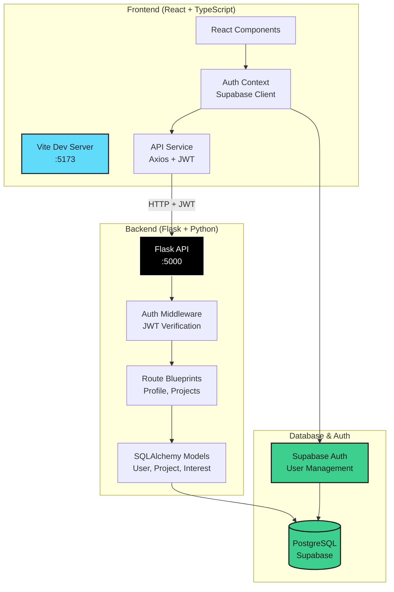

# code-connect

Code Connect is a platform that matches idea generators with student developers and early-career programmers who want to build impressive portfolio projects. It enables collaboration on real open source work while helping developers gain practical experience and legitimate GitHub contributions.

